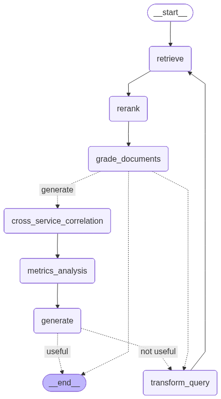

# MicroAIgent

An AI-powered microservices log analysis system built upon NVIDIA's Multi-Agent Self-Corrective RAG framework. MicroAIgent extends the original [NVIDIA Log Analysis Multi-Agent RAG tutorial](https://github.com/NVIDIA/GenerativeAIExamples/tree/main/community/log_analysis_multi_agent_rag) to provide intelligent log analysis, and root-cause detection for microservices architectures.

## 🎥 Demo
[](https://www.youtube.com/watch?v=buOPf8WkfL8)

## 🎯 Overview

MicroAIgent transforms overwhelming microservices logs into actionable insights using a multi-agent AI workflow. Instead of manually sifting through endless log files, developers and DevOps teams can ask natural language questions and receive intelligent, context-aware answers about system failures, performance issues, and anomalies.

### Key Features Extended from NVIDIA Tutorial

#### Multi-Microservice Data Ingestion
- Ingest, extract rich metadata, and index logs from multiple microservices simultaneously (not limited to a single log file)
- Generate and store embeddings for distributed system analysis

#### Advanced MCP Tools for Microservices Analysis

**Metrics Analysis Server** (`mcp_server_metrics.py`)
- 8 specialized tools for analyzing Go application metrics
- Monitor memory usage, garbage collection, goroutines, CPU utilization, and more
- `diagnose_error_correlation`: Links error patterns to performance metrics

**Cross-Service Analysis Server** (`mcp_server_cross-services.py`)
- `correlate_cross_service_errors`: Discovers related log entries across microservices within the same time window

**Enables comprehensive root cause analysis** by coordinating troubleshooting across microservices and intelligently correlating log errors with system metrics

#### Intelligent Agent Orchestration
- **MCPNode Integration**: Seamlessly integrates MCP tools into the LangGraph workflow
- **ReAct Agent**: Autonomously decides which tools to call
- **Multi-Tool Execution**: Agent can run multiple tool calls per query for thorough analysis

#### Interactive Web Interface
- Built with Streamlit for intuitive user interaction
- Real-time log analysis and visualization

#### Tutorial & Documentation
- `langgraph_mcp_tutorial.ipynb`: Step-by-step guide demonstrating how to build LangGraph with MCP Tools
- Reference the specific commit where this tutorial was added for compatible file versions

## 🏗️ Architecture

MicroAIgent implements a directed graph workflow where each node represents a specialized AI agent:


### Core Components

| Component | File | Purpose |
|-----------|------|---------|
| **StateGraph** | `app.py` | Orchestrates the multi-agent workflow using LangGraph's state management system |
| **Local Nodes** | `graphnodes.py` | Implements retrieval, reranking, grading, generation, and query transformation nodes |
| **MCP Nodes** | `mcpnodes.py` | Integrates MCP tools into LangGraph, enabling ReAct agent to invoke external tools |
| **Conditional Edges** | `graphedges.py` | Encodes decision logic and routing between nodes |
| **MCP Tools - Metrics** | `mcp_server_metrics.py` | 8 tools for analyzing Go metrics (memory, GC, CPU) and correlating errors with performance |
| **MCP Tools - Cross-Service** | `mcp_server_cross-services.py` | Discovers correlated logs across microservices within matching time windows |
| **Hybrid Retriever** | `multiagent.py` | Ingests logs with rich metadata extraction; combines BM25 and FAISS retrieval |
| **Retriever Manager** | `multiagent.py` | Manages document lifecycle and prevents duplicate ingestion |
| **Output Models** | `binary_score_models.py` | Structured outputs for grading |
| **Utilities** | `utils.py` | Helper functions for NVIDIA AI endpoint integration and common operations |
| **Prompt Templates** | `prompt.json` | Centralized prompt definitions for each agent role |


## 🚀 Getting Started

### Installation

1. **Clone the repository**
```bash
git clone https://github.com/minhanhhh233/MicroAIgent.git
cd MicroAIgent
```

2. **Create a virtual environment and install dependencies using uv**
```bash
uv venv
uv pip install -r requirements.txt
source .venv/bin/activate  # For Windows: .venv\Scripts\activate
```

3. **Create a .env file with your API keys (copy from .env.example)**
```bash
cp .env.example .env
```
Edit the `.env` file with your API keys:
```bash
# Required
API_KEY=your_nvidia_api_key_here

# Optional - Enable LangSmith tracing for debugging
LANGSMITH_API_KEY=your_langsmith_api_key_here
```

### Usage

1. **Start the Streamlit application.**
```bash
streamlit run app.py
```
2. **The application will run in the browser and display the main interface.**

### Hands-on Tutorial
For developers interested in understanding the MCP and LangGraph integration in depth, explore our comprehensive Jupyter notebook:

📓 **[langgraph_mcp_tutorial.ipynb](langgraph_mcp_tutorial.ipynb)**

## 📚 References

- [Log Analysis Multi-Agent RAG tutorial](https://github.com/NVIDIA/GenerativeAIExamples/tree/main/community/log_analysis_multi_agent_rag)
- [teddynote-lab](https://github.com/teddynote-lab)